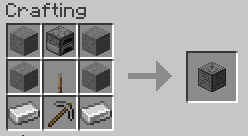
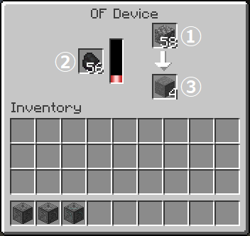
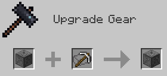
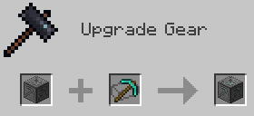

# O.F.Device

O.F.Device is a Minecraft mod to add devices for farming ores.

## Download

- [Download latest](https://github.com/Iunius118/O.F.Device/releases/latest)

## Description

### OF Device (ＯＦ装置)

#### Recipe

#### GUI

1. Material slot (材料), only Cobblestone or Netherrack (丸石かネザーラックのみ)
2. Fuel slot (燃料)
3. Product slot (生成物)

If the output slot is full during operation, the products are ejected out of the block. Hopper can be used to push materials and fuel into device, and to pull products from device.

ホッパーを上面・側面・下面（それぞれ材料搬入・燃料搬入・生成物搬出）へ接続可能。特に生成物スロットのアイテムは自動的に装置外へ排出されることがあるので下面への設置を強く推奨。

#### Products

- Products made from Cobblestone:
  - Stone, Coal Ore, Iron Ore, Lapis Lazuli Ore
- Products made from Netherrack:
  - Nether Brick, Nether Quartz Ore, Nether Gold Ore

### OF Device Mod 1 (ＯＦ装置改)

#### Recipe

#### Products

- Products made from Cobblestone:
  - Stone, Coal Ore, Iron Ore, Redstone Ore, Gold Ore, Lapis Lazuli Ore, Diamond Ore
- Products made from Netherrack:
  - Nether Brick, Nether Quartz Ore, Nether Gold Ore

### OF Device Mod 2 (ＯＦ装置改二)

#### Recipe

#### Products

- Products made from Cobblestone:
  - Stone, Coal Ore, Iron Ore, Redstone Ore, Gold Ore, Lapis Lazuli Ore, Diamond Ore, Emerald Ore
- Products made from Netherrack:
  - Nether Brick, Nether Quartz Ore, Nether Gold Ore, Ancient Debris

## License

- MIT license

----
Copyright © 2021 Iunius118
