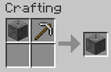
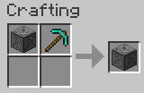

# O.F.Device

O.F.Device is a Minecraft mod to add devices for farming ores.

## Download

- [Download latest](https://github.com/Iunius118/O.F.Device/releases/latest)

## Description

v1.18-0.2.0

### OF Device (ＯＦ装置)

#### Recipe

4 Stones + Furnace + Lever + 2 Iron Ingots + Stone Pickaxe

#### GUI

1. Material slot (材料), only Cobblestone or Netherrack (丸石かネザーラックのみ)
2. Fuel slot (燃料)
3. Product slot (生成物)

If the output slot is full during operation, the products are ejected out of the block. Hopper can be used to push materials and fuel into device, and to pull products from device.

装置の上面・側面・下面にホッパーを接続してアイテムの搬入出が可能（それぞれ材料搬入・燃料搬入・生成物搬出）。特に生成物スロットのアイテムは自動的に排出されることがあるため、下面へのホッパー設置を強く推奨。

#### Products

|  | Cobblestone | Cobbled Deepslate | Netherrack |
| :---: | :---: | :---: | :---: |
| **Majority** | Stone | Deepslate | Nether Brick |
| **Uncommon** | Coal Ore |  |  |
| **Rare** | Iron Ore,  Copper Ore | Deepslate Iron Ore | Nether Quartz Ore |
| **Very Rare** |  | Deepslate Copper Ore | Nether Gold Ore |
| **Legendary** | Lapis Lazuli Ore | Deepslate Lapis Lazuli Ore,  Deepslate Coal Ore |  |

### OF Device Mod 1 (ＯＦ装置改)

#### Recipe

OF Device + Iron Pickaxe

#### Products

|  | Cobblestone | Cobbled Deepslate | Netherrack |
| :---: | :---: | :---: | :---: |
| **Majority** | Stone | Deepslate | Nether Brick |
| **Uncommon** | Coal Ore |  |  |
| **Rare** | Iron Ore,  Copper Ore | Deepslate Redstone Ore,  Deepslate Iron Ore | Nether Quartz Ore |
| **Very Rare** | Redstone Ore | Deepslate Copper Ore,  Deepslate Gold Ore,  Deepslate Diamond Ore | Nether Gold Ore |
| **Legendary** | Lapis Lazuli Ore,  Gold Ore | Deepslate Lapis Lazuli Ore,  Deepslate Coal Ore |  |
| **Mythic** | Diamond Ore |  |  |

### OF Device Mod 2 (ＯＦ装置改二)

#### Recipe

OF Device Mod 1 + Diamond Pickaxe

#### Products

|  | Cobblestone | Cobbled Deepslate | Netherrack |
| :---: | :---: | :---: | :---: |
| **Majority** | Stone | Deepslate | Nether Brick |
| **Uncommon** | Coal Ore,  Copper Ore |  |  |
| **Rare** | Iron Ore,  Gold Ore | Deepslate Redstone Ore,  Deepslate Copper Ore,  Deepslate Iron Ore | Nether Quartz Ore |
| **Very Rare** | Redstone Ore | Deepslate Gold Ore,  Deepslate Diamond Ore | Nether Gold Ore |
| **Legendary** | Lapis Lazuli Ore,  Emerald Ore | Deepslate Lapis Lazuli Ore,  Deepslate Coal Ore |  |
| **Mythic** | Diamond Ore | Deepslate Emerald Ore | Ancient Debris |

## License

- MIT license

----
Copyright © 2021 Iunius118
