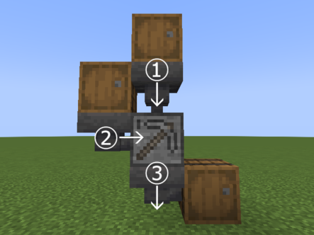
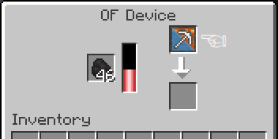
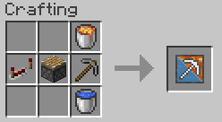
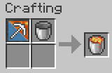

# O.F.Device (Ore Farming Device)

O.F.Device is a Minecraft mod to add devices for farming ores.

材料と燃料を消費して一定確率で鉱石を生成できる装置を追加するmodです。

## Download

## Description

Version 0.9.0

### OF Device (ＯＦ装置)

#### Recipe

4 Stones + Furnace + Lever + 2 Iron Ingots + Stone Pickaxe

#### GUI

1. Material slot (材料). Only Cobblestone, Cobbled Deepslate, Netherrack, or OF Cobblestone Feeder (丸石・深層岩の丸石・ネザーラック・ＯＦ丸石供給装置のみ)
2. Fuel slot (燃料)
3. Product slot (生成物)

If the output slot is full during operation, the products are ejected out of the block. Hopper can be used to push materials and fuel into device, and to pull products from device.

装置の上面・側面・下面にホッパーを接続してアイテムの搬入出が可能（それぞれ材料搬入・燃料搬入・生成物搬出）。特に生成物スロットのアイテムは自動的に排出されることがあるため、下面へのホッパー設置を強く推奨。

#### Products

|               |       Cobblestone        |                 Cobbled Deepslate                  |    Netherrack     |
|:-------------:|:------------------------:|:--------------------------------------------------:|:-----------------:|
| **Majority**  |          Stone           |                     Deepslate                      |   Nether Brick    |
| **Uncommon**  |         Coal Ore         |                                                    |                   |
|   **Rare**    | Iron Ore,  Copper Ore |                 Deepslate Iron Ore                 | Nether Quartz Ore |
| **Very Rare** |                          |                Deepslate Copper Ore                |  Nether Gold Ore  |
| **Legendary** |     Lapis Lazuli Ore     | Deepslate Lapis Lazuli Ore,  Deepslate Coal Ore |                   |

Appearance rate of ores increases with number (up to 3) of players, villagers, etc. around OF Devices (5x3x5).

ＯＦ装置の周囲にプレイヤーや村人など（最大3人まで）がいると、鉱石の出現率が上昇します。

### OF Device Mod 1 (ＯＦ装置改)

Modified version of OF Device. Processing speed is faster than OF Device.

ＯＦ装置の改造版。ＯＦ装置よりも処理速度が速い。

#### Recipe

OF Device + Iron Pickaxe

#### Products

|               |          Cobblestone           |                            Cobbled Deepslate                            |    Netherrack     |
|:-------------:|:------------------------------:|:-----------------------------------------------------------------------:|:-----------------:|
| **Majority**  |             Stone              |                                Deepslate                                |   Nether Brick    |
| **Uncommon**  |            Coal Ore            |                                                                         |                   |
|   **Rare**    |    Iron Ore,  Copper Ore    |             Deepslate Redstone Ore,  Deepslate Iron Ore              | Nether Quartz Ore |
| **Very Rare** |          Redstone Ore          | Deepslate Diamond Ore,  Deepslate Copper Ore,  Deepslate Gold Ore |  Nether Gold Ore  |
| **Legendary** | Lapis Lazuli Ore,  Gold Ore |           Deepslate Lapis Lazuli Ore,  Deepslate Coal Ore            |                   |
|  **Mythic**   |          Diamond Ore           |                                                                         |                   |

### OF Device Mod 2 (ＯＦ装置改二)

Modified version of OF Device Mod 1. Processing speed is faster than OF Device Mod 1.

ＯＦ装置改の改造版。ＯＦ装置改よりも処理速度が速い。

#### Recipe

OF Device Mod 1 + Diamond Pickaxe

#### Products

|               |                      Cobblestone                      |                                      Cobbled Deepslate                                       |    Netherrack     |
|:-------------:|:-----------------------------------------------------:|:--------------------------------------------------------------------------------------------:|:-----------------:|
| **Majority**  |                         Stone                         |                                          Deepslate                                           |   Nether Brick    |
| **Uncommon**  |               Coal Ore,  Copper Ore                |                                                                                              |                   |
|   **Rare**    |                Iron Ore,  Gold Ore                 |           Deepslate Redstone Ore,  Deepslate Copper Ore,  Deepslate Iron Ore           | Nether Quartz Ore |
| **Very Rare** |                     Redstone Ore                      |                        Deepslate Diamond Ore,  Deepslate Gold Ore                         |  Nether Gold Ore  |
| **Legendary** | Lapis Lazuli Ore,  Amethyst Shard,  Emerald Ore |            Deepslate Lapis Lazuli Ore,  Amethyst Shard,  Deepslate Coal Ore            |                   |
|  **Mythic**   |                      Diamond Ore                      |                                    Deepslate Emerald Ore                                     |  Ancient Debris   |

### OF Cobblestone Feeder (ＯＦ丸石供給装置)

OF Cobblestone Feeder provides an infinite supply of Cobblestones to OF Devices.

ＯＦ装置の材料スロットに入れると装置へ無限に丸石を供給する。

#### Recipe

Lava Bucket + Redstone Repeater + Piston + Stone Pickaxe + Water Bucket

#### Recycling Recipe

OF Cobblestone Feeder + Bucket -> Lava Bucket

### Config

`(world_save_dir)/serverconfig/orefarmingdevice-server.toml`

Restart the game when you change the config. In multiplayer mode, server-side config will be used.

コンフィグを変更したときはゲームを再起動してください。マルチプレイの場合はサーバー側のコンフィグが使われます。

- isCobblestoneFeederAvailable (boolean, default value is true)
  - Whether OF Cobblestone Feeder is available for devices
  - ＯＦ丸石供給装置がＯＦ装置で材料として使えるか（true→使える、false→使えない）
- enableFarmingEfficiency (boolean, default value is true)
  - Whether mobs around device increase farming efficiency of device
  - ＯＦ装置の周囲にモブがいるとき、鉱石の出現率が上昇するか（true→する、false→しない）
- accelerateProcessingSpeedByMod (boolean, default value is true)
  - Whether to accelerate processing speed of device by modification
  - ＯＦ装置の改造によって処理速度が上昇するか（true→する、false→しない）
- increaseFuelConsumptionByMod (boolean, default value is true)
  - Whether to increase fuel consumption of device by modification
  - ＯＦ装置の改造によって燃料消費量が増加するか（true→する、false→しない）

## License

- MIT license

----
Copyright © 2021 Iunius118
